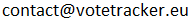

This is the readme to contribute to the [votetracker.eu](https://votetracker.eu) project.

### Translations 

I can start translating to European languages I don't know with A.I. but I'd like to have human validations. \
If you are eager to check a translation, please contact me at 
, I will send you the necessary file.
Thank you


#### for devs:

To add translations, run
```
django-admin makemessages --no-wrap --locale <locale id like "fr" or "en">
```
It will generate a .po file in the `locale` directory.
The translation are to be written inside the quotes of the `msgstr ""`.
Look also for the `fuzzy` keyword that point to unclear translations.
The `&#37;` that you can find is the html code for `%`. Use `&#37;` instead of `%`, which is a mess to use here.
When it is translated, add the language code in the `LANGUAGES` variable in settings.py

Then run 
```
django-admin compilemessages
```

Restart the server and check everything is ok.
Do the merge request.
Thanks :-)


### Make it work on local computer

It is built with python django. 
The database is needed because MEPs have the ability to add comments on their stances (when they will be invited to).

If you use conda:
```
conda create --name django5 python=3.11
conda activate django5
```
Otherwise see [here](https://docs.djangoproject.com/en/5.0/topics/install/#install-the-django-code)

```
pip install --upgrade pip
pip install -r requirements.txt
```

In the `yvm_site` folder, add a `.env` file with this content:
```
MODE=DEV
ALLOWED_HOSTS=.localhost
DB_ENGINE=<mysql or postgresql>
DATABASE_NAME=<you named it when creating the db in phpmyadmin>
DATABASE_USER=<you named it when creating the db in phpmyadmin>
DATABASE_PASSWORD=<you named it when creating the db in phpmyadmin>
DATABASE_PORT=<usually 3306 for mysql, 5432 for postgresql>
MEP_INITIAL_PASSWORD=<it will be used in populate_mep_table.py>
SECRET_KEY=<a very long secret key of your choice>
```
Add `.env` in your .gitignore

Download `ep_meps.json.lz` and `ep_votes.json.lz` on [parltrack](https://parltrack.org/dumps). 
Unzip them in the already existing `parltrack_data` folder

Run :
```
python populate_mep_table.py
python populate_vote_and_position_tables.py
```

Then
```
python manage.py runserver
```


### License

<p xmlns:cc="http://creativecommons.org/ns#" xmlns:dct="http://purl.org/dc/terms/"><a property="dct:title" rel="cc:attributionURL" href="https://votetracker.eu/">votetracker.eu</a> by <span property="cc:attributionName">Pierre LOICQ</span> is licensed under <a href="http://creativecommons.org/licenses/by/4.0/?ref=chooser-v1" target="_blank" rel="license noopener noreferrer" style="display:inline-block;">CC BY 4.0</a></p>

